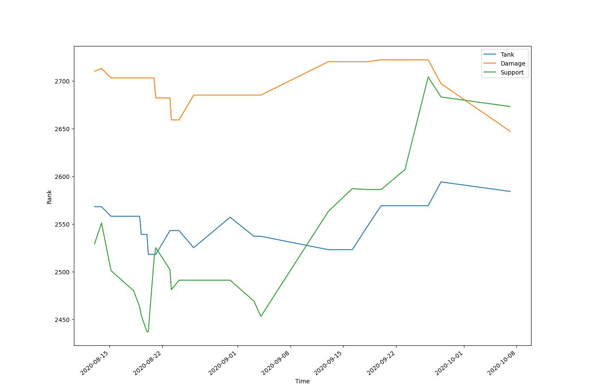

# Overwatch Rank Data

This program collects the a specified user's rank in the online FPS "Overwatch", stores that rank in a database, and then graphs it out for the user to see.

Techonology used: Python3, SQL, sqlalchemy, pandas, matplotlib

